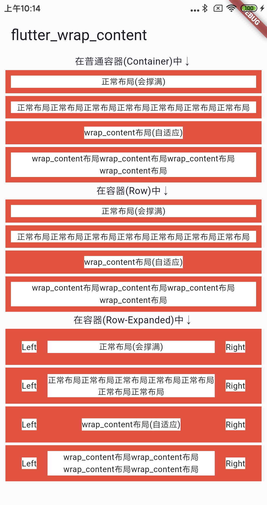

[](https://pub.dev/packages/flutter_wrap_content)

# flutter_wrap_content

Flutter 实现 Android 中的 wrap_content 效果.

与`ConstrainedBox`的不同在于, `ConstrainedBox`只能指定`maxWidth`的约束值,而不能继承`maxWidth`的约束值.



## Installation

安装最新版本 [](https://pub.dev/packages/flutter_wrap_content/install)

## Quick Start

导入对应的包, 使用 `wrapContent` 扩展方法包裹需要实现 `wrap_content` 效果的组件即可.

```dart
Widget(...).wrapContent();
```

支持的属性:

```dart
AlignmentDirectional alignment;
double? minWidth;
double? minHeight;
```

## License

MIT License

Copyright (c) 2023 angcyo